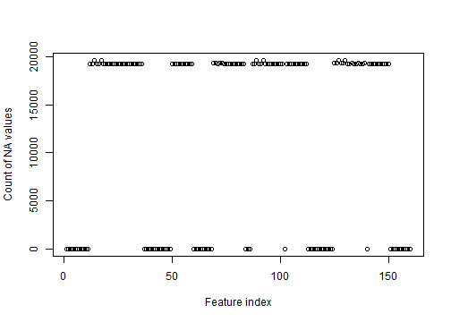
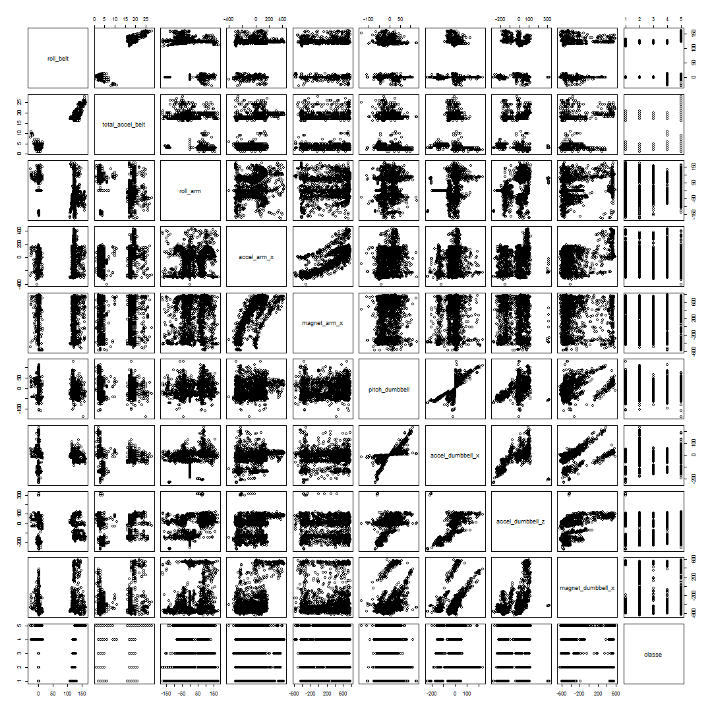

Project Write-up for the course 
"Practical Machine Learning" (Jul 07 2014) project
========================================================

Background
========================================================
Short desc
Article ref
Data download link

Cleaning the data
========================================================

At first the data is loaded, empty or NA strings are replaced with R NA.
    

```r
badEntries<-c("","NA", "#DIV/0!")
traindata <- read.csv("pml-training.csv", na.strings=badEntries)
testdata <- read.csv("pml-testing.csv", na.strings=badEntries)
```


```r
dim(traindata)
```

```
## [1] 19622   160
```
The data that can be used for training is 19622 observations with 159 features and one reponse variable.

We analyse how prevalent are the NA values in the training data.

```r
countVectNA<- function(x) {sum(is.na(x))}
columnNA <- apply(traindata,2,countVectNA)
keepColumns<-(columnNA==0)
```


Since there are 160 features an efficient way to get an overview would be a simple plot.


```r
plot(columnNA, xlab="Feature index", ylab="Count of NA values" )
```

 

We can see that the data is either provided or entirelly missing, so we do not have to deal with the missing data using methods as e.g. knnImpute, we just remove the empty columns. Also since this is not a time series analysis project, we are removing the time - related data.


```r
traindata <- traindata[,keepColumns]
testdata <- testdata[,keepColumns]
not_interesting<-c(1,2,3,4,5,6,7)
traindata<-traindata[,-not_interesting]
testdata<-testdata[,-not_interesting]
```


Feature reduction
=========================================================

```r
columncount<-dim(traindata)[2]
columncount
```

```
## [1] 53
```

We are dealing with 52 features, which is computationally feasible. Nevertheless it would be interesting to see if features can be reduced and satisfactory accuracy can be achieved. We do so by looking at features that have some corelation to the class.


```r
delme<-data.frame(traindata[,-columncount], as.numeric(traindata[,columncount]))
corclass<-cor(delme)[,columncount]
corelated<-c(which(corclass > 0.05))
traindata<-traindata[,corelated]
traindata<-traindata[,corelated]
```

```
## Error: undefined columns selected
```


This leaves us with the following 12 features

```r
names(traindata)
```

```
##  [1] "roll_belt"           "total_accel_belt"    "roll_arm"           
##  [4] "accel_arm_x"         "magnet_arm_x"        "pitch_dumbbell"     
##  [7] "accel_dumbbell_x"    "accel_dumbbell_z"    "magnet_dumbbell_x"  
## [10] "magnet_dumbbell_z"   "pitch_forearm"       "total_accel_forearm"
## [13] "classe"
```

Training and testing
===========================================================
Since we cannot tune the model on testdata (only two submissions are allowed), we will be taking a part of the training dataset for testing. Using a part of the training data as testdata also reduces the out of sample error, which can be important in some algorithms(linear/logistic regression), less so in others(random forests). 


```r
library(caret)
set.seed(314568)
train_index <- createDataPartition(y = traindata$classe, p=0.7,list=FALSE) 
mtrain<-traindata[train_index,]
mtest<-traindata[-train_index,]
```

We first look at the graphical information of a random subset of the data. 


```r
viz_index <- createDataPartition(y = traindata$classe, p=0.1,list=FALSE) 
pairs(traindata[viz_index,c(1:9, 13)])
```

 

We can identify that data is clustered, but some parameters are corelated. Random forest with principal component analysis would be a suitable machine learning algorithm for such data.

#modRfCenterSc<-train(classe~.,method = "rf", data = mtrain,preprocess=c("center", "scale"))
#modRfPca<-train(classe~.,method = "rf", data = mtrain,preprocess="pca")
#forest1<-randomForest(classe ~., data=mtrain, method="pca")
#preds<-predict(modFit, newdata=preptest)
#confusionMatrix(mtest$classe, preds)

